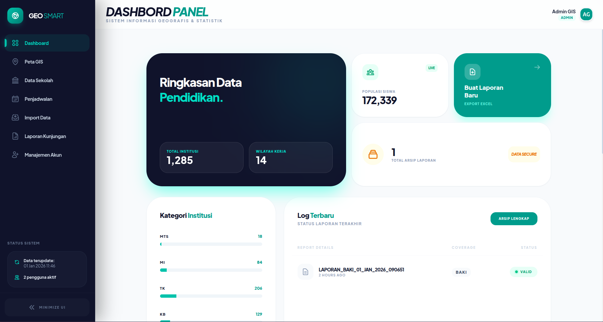
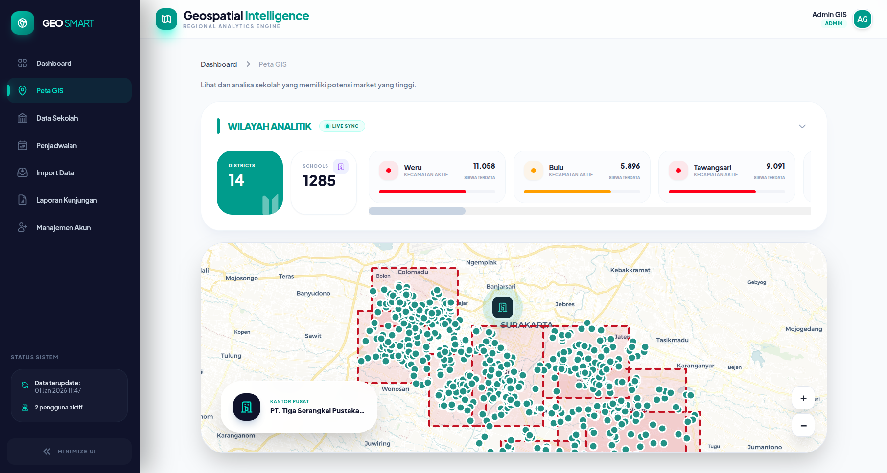
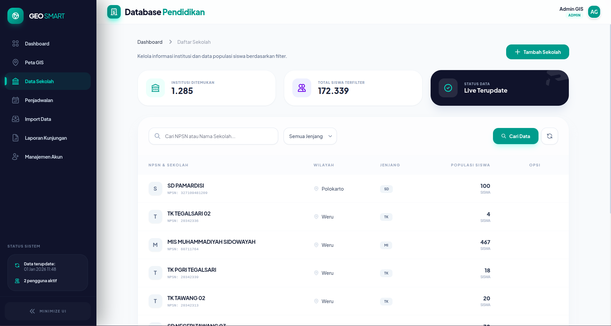
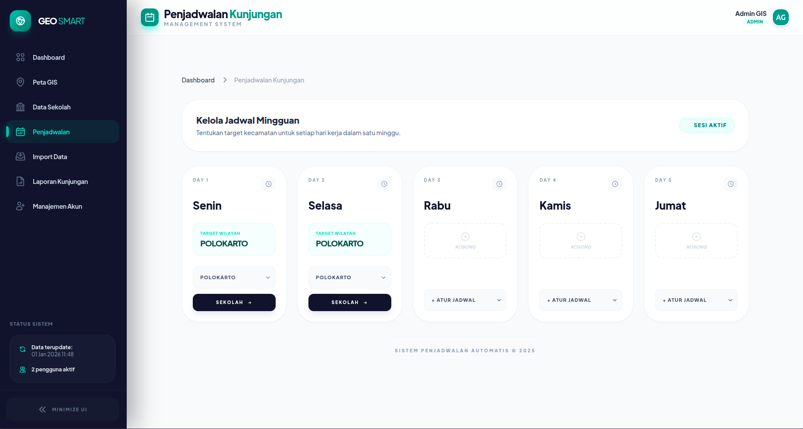

# 🗺️ Geospatial Intelligence System


Sistem manajemen data geospasial berbasis web untuk monitoring dan analisis distribusi sekolah menggunakan teknologi
peta interaktif.

## 📋 Daftar Isi

- [Fitur Utama](#-fitur-utama)
- [Tech Stack](#-tech-stack)
- [Persyaratan Sistem](#-persyaratan-sistem)
- [Instalasi](#-instalasi)
- [Struktur Route](#-struktur-route)
- [Dokumentasi API](#-dokumentasi-api)
- [Package Dependencies](#-package-dependencies)
- [Penggunaan](#-penggunaan)
- [Screenshot](#-screenshot)
- [Contributing](#-contributing)
- [License](#-license)

## ✨ Fitur Utama

### 🗺️ Peta Interaktif

- Visualisasi lokasi sekolah dengan marker interaktif
- District boundaries dengan styling custom
- Office location marker dengan animasi
- Real-time map controls dengan Leaflet.js
- Responsive map layout dengan sidebar toggle

### 📊 Dashboard Analytics

- Statistik kecamatan dan sekolah
- Kepadatan siswa per wilayah
- Live monitoring indicator
- Data visualization dengan chart

### 🏫 Manajemen Sekolah

- CRUD operasi untuk data sekolah
- Import data sekolah dari Excel/CSV
- Template download untuk import
- Geocoding otomatis dari alamat
- Filter berdasarkan kecamatan

### 📅 Jadwal Kunjungan

- Penjadwalan kunjungan ke sekolah
- Kalender interaktif
- Manajemen jadwal harian
- Status tracking kunjungan

### 📄 Laporan & Ekspor

- Generate laporan berdasarkan district
- Export data ke Excel
- Filter sekolah per kecamatan
- Custom report builder

### 👥 Manajemen User

- User authentication & authorization
- User management dashboard
- Active users tracking
- Role-based access control

## 🛠️ Tech Stack

### Backend

- **Laravel 10.x** - PHP Framework
- **PHP 8.1+** - Programming Language
- **MySQL/PostgreSQL** - Database dengan PostGIS extension
- **Laravel Breeze** - Authentication scaffolding
- **Laravel Sanctum** - API Authentication

### Frontend

- **Alpine.js** - Reactive JavaScript framework
- **Tailwind CSS** - Utility-first CSS framework
- **Leaflet.js 1.9.4** - Interactive maps
- **Heroicons** - Beautiful SVG icons

### Geospatial

- **Laravel Eloquent Spatial** - Spatial data types support
- **GeoPHP** - Geometry library untuk PHP
- **PostGIS** - Spatial database extender

### Data Processing

- **Maatwebsite Excel** - Excel import/export

## 📦 Persyaratan Sistem

- PHP >= 8.1
- Composer
- Node.js & NPM
- MySQL 8.0+ atau PostgreSQL 12+ dengan PostGIS extension
- Apache/Nginx web server

## 🚀 Instalasi

### 1. Clone Repository

```bash
git clone https://github.com/your-username/geospatial-intelligence.git
cd geospatial-intelligence
```

### 2. Install Dependencies

```bash
# Install PHP dependencies
composer install

# Install JavaScript dependencies
npm install
```

### 3. Environment Configuration

```bash
# Copy environment file
cp .env.example .env

# Generate application key
php artisan key:generate
```

### 4. Database Setup

Edit file `.env`:

```env
DB_CONNECTION=mysql
DB_HOST=127.0.0.1
DB_PORT=3306
DB_DATABASE=geospatial_db
DB_USERNAME=root
DB_PASSWORD=
```

Untuk PostgreSQL dengan PostGIS:

```env
DB_CONNECTION=pgsql
DB_HOST=127.0.0.1
DB_PORT=5432
DB_DATABASE=geospatial_db
DB_USERNAME=postgres
DB_PASSWORD=
```

### 5. Run Migrations

```bash
# Run migrations
php artisan migrate

# Run seeders (optional)
php artisan db:seed
```

### 6. Build Assets

```bash
# Development
npm run dev

# Production
npm run build
```

### 7. Start Development Server

```bash
php artisan serve
```

Aplikasi dapat diakses di: `http://localhost:8000`

## 🛣️ Struktur Route

### Public Routes

| Method | URI         | Name     | Description          |
|--------|-------------|----------|----------------------|
| GET    | `/`         | -        | Landing page         |
| GET    | `/login`    | login    | Login form           |
| POST   | `/login`    | -        | Process login        |
| GET    | `/register` | register | Registration form    |
| POST   | `/register` | -        | Process registration |

### Protected Routes (Requires Authentication)

#### Dashboard

| Method | URI          | Name      | Description    |
|--------|--------------|-----------|----------------|
| GET    | `/dashboard` | dashboard | Main dashboard |

#### System Status API

| Method | URI                  | Description                      |
|--------|----------------------|----------------------------------|
| GET    | `/api/system-status` | Get active users and last update |

#### Profile Management

| Method | URI        | Name            | Description       |
|--------|------------|-----------------|-------------------|
| GET    | `/profile` | profile.edit    | Edit profile form |
| PATCH  | `/profile` | profile.update  | Update profile    |
| DELETE | `/profile` | profile.destroy | Delete account    |

#### User Management

| Method    | URI                  | Name          | Description       |
|-----------|----------------------|---------------|-------------------|
| GET       | `/users`             | users.index   | List all users    |
| GET       | `/users/create`      | users.create  | Create user form  |
| POST      | `/users`             | users.store   | Store new user    |
| GET       | `/users/{user}`      | users.show    | Show user details |
| GET       | `/users/{user}/edit` | users.edit    | Edit user form    |
| PUT/PATCH | `/users/{user}`      | users.update  | Update user       |
| DELETE    | `/users/{user}`      | users.destroy | Delete user       |

#### Geospatial Map

| Method | URI    | Name      | Description          |
|--------|--------|-----------|----------------------|
| GET    | `/map` | map.index | Interactive map view |

#### School Data Import

| Method | URI                    | Name            | Description       |
|--------|------------------------|-----------------|-------------------|
| GET    | `/import`              | import.index    | Import history    |
| POST   | `/import`              | import.store    | Process import    |
| GET    | `/import/template`     | import.template | Download template |
| GET    | `/import/{import}/log` | import.log      | View import log   |

#### School Management

| Method    | URI                      | Name            | Description         |
|-----------|--------------------------|-----------------|---------------------|
| GET       | `/schools`               | schools.index   | List all schools    |
| GET       | `/schools/create`        | schools.create  | Create school form  |
| POST      | `/schools`               | schools.store   | Store new school    |
| GET       | `/schools/{school}`      | schools.show    | Show school details |
| GET       | `/schools/{school}/edit` | schools.edit    | Edit school form    |
| PUT/PATCH | `/schools/{school}`      | schools.update  | Update school       |
| DELETE    | `/schools/{school}`      | schools.destroy | Delete school       |

#### Schedule Management

| Method | URI                | Name            | Description         |
|--------|--------------------|-----------------|---------------------|
| GET    | `/schedules`       | schedules.index | List schedules      |
| POST   | `/schedules/store` | schedules.store | Create schedule     |
| GET    | `/schedules/{day}` | schedules.show  | Show daily schedule |

#### Report Management

| Method | URI                    | Name               | Description             |
|--------|------------------------|--------------------|-------------------------|
| GET    | `/reports`             | reports.index      | Report dashboard        |
| POST   | `/reports/store`       | reports.store      | Generate report         |
| GET    | `/reports/export/{id}` | reports.export     | Export report           |
| GET    | `/reports/get-schools` | reports.getSchools | Get schools by district |

## 📡 Dokumentasi API

### System Status API

**Endpoint:** `GET /api/system-status`

**Response:**

```json
{
    "active_users": 42,
    "last_update": "01 Jan 2026 14:30"
}
```

### Get Schools by District

**Endpoint:** `GET /reports/get-schools?district_id={id}`

**Parameters:**

- `district_id` (required): ID kecamatan

**Response:**

```json
{
    "schools": [
        {
            "id": 1,
            "name": "SDN 1 Example",
            "type": "SD",
            "district_id": 1
        }
    ]
}
```

## 📦 Package Dependencies

### Production Dependencies

```json
{
    "php": "^8.1",
    "guzzlehttp/guzzle": "^7.2",
    "laravel/framework": "^10.10",
    "laravel/sanctum": "^3.3",
    "laravel/tinker": "^2.8",
    "maatwebsite/excel": "^3.1",
    "matanyadaev/laravel-eloquent-spatial": "^4.5",
    "phayes/geophp": "^1.2"
}
```

#### Penjelasan Package:

- **guzzlehttp/guzzle** - HTTP client untuk API requests
- **laravel/framework** - Laravel framework core
- **laravel/sanctum** - API authentication
- **laravel/tinker** - REPL untuk debugging
- **maatwebsite/excel** - Import/export Excel files
- **matanyadaev/laravel-eloquent-spatial** - Spatial data types untuk Eloquent
- **phayes/geophp** - Geometry manipulation library

### Development Dependencies

```json
{
    "fakerphp/faker": "^1.9.1",
    "laravel/breeze": "^1.29",
    "laravel/pint": "^1.0",
    "laravel/sail": "^1.18",
    "mockery/mockery": "^1.4.4",
    "nunomaduro/collision": "^7.0",
    "phpunit/phpunit": "^10.1",
    "spatie/laravel-ignition": "^2.0"
}
```

## 💡 Penggunaan

### Import Data Sekolah

1. Download template Excel dari menu Import
2. Isi data sekolah sesuai format template
3. Upload file Excel melalui form import
4. Sistem akan otomatis:
    - Validasi data
    - Geocoding alamat menjadi koordinat
    - Menyimpan data ke database
    - Generate import log

### Menambah Sekolah Manual

1. Akses menu Schools
2. Klik tombol "Tambah Sekolah"
3. Isi form dengan data sekolah
4. Masukkan koordinat atau alamat (sistem akan geocoding otomatis)
5. Submit form

### Melihat Peta Interaktif

1. Akses menu Map
2. Peta akan menampilkan:
    - **Office marker** (biru dengan ikon gedung)
    - **School markers** (hijau dengan circle)
    - **District boundaries** (polygon dengan warna berbeda)
3. Klik marker untuk melihat detail
4. Toggle sidebar untuk melihat statistik

### Generate Laporan

1. Akses menu Reports
2. Pilih kecamatan
3. Sistem akan load daftar sekolah
4. Pilih sekolah yang ingin dilaporkan
5. Klik Generate Report
6. Export ke Excel jika diperlukan

## 🎨 Kustomisasi

### Mengubah Warna District

Edit file migration atau seeder untuk menambah kolom `color_hex`:

```php
$district->color_hex = '#14b8a6'; // Teal color
```

### Mengubah Map Center

Edit controller `MapController.php`:

```php
$office = Office::first(); // Default office location
```

### Custom Map Styling

Edit file blade `map/index.blade.php`:

```javascript
L.tileLayer('https://{s}.basemaps.cartocdn.com/rastertiles/voyager/{z}/{x}/{y}{r}.png', {
    maxZoom: 19
}).addTo(map);
```

Pilihan map tiles lain:

- OpenStreetMap: `https://{s}.tile.openstreetmap.org/{z}/{x}/{y}.png`
- Dark mode: `https://{s}.basemaps.cartocdn.com/dark_all/{z}/{x}/{y}{r}.png`

## 🖼️ Screenshot

### Dashboard



### Interactive Map



### School Management



### Schedule Management



## 🤝 Contributing

Kontribusi selalu diterima! Silakan ikuti langkah berikut:

1. Fork repository
2. Create feature branch (`git checkout -b feature/AmazingFeature`)
3. Commit changes (`git commit -m 'Add some AmazingFeature'`)
4. Push to branch (`git push origin feature/AmazingFeature`)
5. Open Pull Request

## 📝 License

Proyek ini dilisensikan di bawah [MIT License](LICENSE).

## 👨‍💻 Developer

Dikembangkan dengan ❤️ untuk sistem monitoring pendidikan

## 📞 Support

Jika Anda memiliki pertanyaan atau menemukan bug, silakan buat issue di repository ini.

---

**Happy Coding!** 🚀
